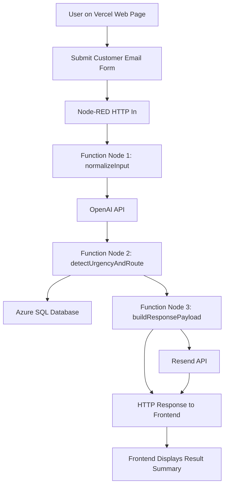

# Technical Architecture Overview

## 1. Project Overview

This project is called **Smart Customer Support Email Management System**. Its goal is to receive customer email content, use a large language model to classify messages and detect urgency, store the processed result in a database, and send notifications or acknowledgement emails when required.

The current technical solution is:

- frontend deployed on `Vercel`
- backend workflow engine implemented with `Node-RED`
- AI classification and analysis powered by `OpenAI`
- email notification service provided by `Resend`
- persistent data storage handled by `Azure SQL Database`

## 2. Layered Architecture

The system is divided into four layers:

1. **Presentation Layer**  
   Users submit customer support email data through a web form deployed on `Vercel`.

2. **Application Logic Layer**  
   `Node-RED` receives HTTP requests, calls AI services, applies business rules, writes data to the database, and triggers notifications.

3. **AI and Communication Services Layer**  
   `OpenAI` is used for message classification and content analysis, while `Resend` is used for notification and acknowledgement emails.

4. **Data Layer**  
   `Azure SQL Database` stores the original email, classification result, urgency flag, timestamp, and processing status.

## 3. Main Components

### Frontend: Vercel Web Page

The frontend provides a simple support form where users can enter:

- customer name
- customer email
- email subject
- email message

After submission, the frontend sends the form data as `JSON` to a `Node-RED` HTTP endpoint.

### Backend: Node-RED Flow

`Node-RED` is the core orchestration platform of the project. It is responsible for:

- receiving requests from the frontend
- cleaning and normalizing the input
- calling the `OpenAI` API for message classification and analysis
- determining whether the message is urgent
- storing the result in the database
- calling `Resend` to send notification or acknowledgement emails
- returning the final response to the frontend

### AI Service: OpenAI

`OpenAI` is used to understand English customer emails and perform these tasks:

- classify the message as `complaint`, `enquiry`, or `feedback`
- detect urgency signals in the message
- generate a short processing summary

### Email Notification: Resend

`Resend` is used to send two types of emails:

- internal notification emails to administrators or the support team
- automatic acknowledgement emails to customers

### Database: Azure SQL Database

The project uses `Azure SQL Database` as the cloud database. It is suitable for storing structured support records and clearly demonstrating cloud persistence and table design.

Suggested fields:

- message_id
- customer_name
- customer_email
- subject
- message_body
- category
- urgency
- ai_summary
- created_at
- status

## 4. Workflow

The recommended workflow is:

1. The user submits email information on the `Vercel` frontend.
2. The frontend sends the request to the `Node-RED` HTTP In node.
3. `Function Node 1` cleans and normalizes the input.
4. `Node-RED` calls the `OpenAI` API for classification and urgency analysis.
5. `Function Node 2` determines routing and urgency based on AI output and keyword rules.
6. The system writes the original input and analysis result into the database.
7. `Function Node 3` prepares the notification payload and frontend response.
8. `Node-RED` calls `Resend` to send internal or customer emails.
9. The frontend displays the final processing summary.

## 5. Three Required Function Nodes

### Function Node 1: normalizeInput

Purpose:

- trim and clean input values
- check required fields
- build a consistent internal data structure
- attach a timestamp

### Function Node 2: detectUrgencyAndRoute

Purpose:

- evaluate urgency using `OpenAI` output and keyword rules
- set `urgent = true/false`
- decide which team should handle the message

### Function Node 3: buildResponsePayload

Purpose:

- prepare the database record
- prepare the email payload for `Resend`
- prepare the final response for the frontend

## 6. Cloud Service Mapping

| Cloud Service | Role in the System |
| --- | --- |
| Vercel | Hosting the frontend web page |
| OpenAI API | Email classification and urgency analysis |
| Resend API | Notification and auto-reply email delivery |
| Azure SQL Database | Persistent storage of support records |

## 7. Advantages of the Current Design

- clear separation between frontend and backend responsibilities
- `Node-RED` is suitable for visual workflow development and demonstration
- `OpenAI` improves classification quality and semantic understanding
- `Resend` is simple to integrate for automated notifications

## 8. Solution Note

Under the updated assignment requirement, the web application can be deployed on other cloud platforms, so using `Vercel` for the frontend is acceptable for this project. The overall solution forms a complete business workflow using `OpenAI`, `Resend`, and `Azure SQL Database`.
