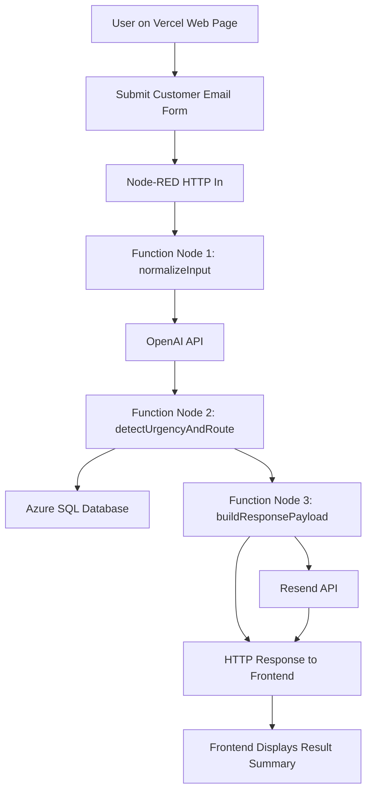

# 技术架构说明

## 1. 项目概述

本项目名称为 **Smart Customer Support Email Management System**。系统目标是接收客户提交的邮件内容，使用大模型进行邮件分类与紧急程度分析，将处理结果保存到数据库，并在需要时通过邮件发送通知或自动回复。

当前项目采用如下技术方案：

- 前端页面部署在 `Vercel` https://smart-email-topaz.vercel.app/
- 后端流程引擎使用 `Node-RED` http://zhangsu1305.australiaeast.azurecontainer.io:1880/#flow/f6f2187d.f17ca8
- AI 分类与分析接口使用 `OpenAI`
- 邮件通知服务使用 `Resend`
- 数据持久化使用 `Azure SQL Database`

## 2. 架构分层

系统分为四层：

1. **Presentation Layer**  
   用户通过部署在 `Vercel` 的网页表单提交客户邮件信息，包括姓名、邮箱、主题和正文。

2. **Application Logic Layer**  
   `Node-RED` 负责接收 HTTP 请求、调用 AI 接口、执行业务规则、写入数据库，并触发通知流程。

3. **AI and Communication Services Layer**  
   `OpenAI` 用于分类和内容分析，`Resend` 用于发送通知邮件和自动回复邮件。

4. **Data Layer**  
   `Azure SQL Database` 用于存储原始邮件、分类结果、紧急标记、时间戳和处理状态。

## 3. 主要组件

### Frontend: Vercel Web Page

前端提供一个简单清晰的客户支持表单，允许用户输入：

- customer name
- customer email
- email subject
- email message

表单提交后，前端将数据以 `JSON` 方式发送到 `Node-RED` 暴露的 HTTP endpoint。

### Backend: Node-RED Flow

`Node-RED` 是本项目的核心编排平台，主要负责：

- 接收来自前端的请求
- 对输入数据进行清洗和标准化
- 调用 `OpenAI` 接口进行邮件分类与分析
- 根据规则判断是否为紧急邮件
- 保存处理结果到数据库
- 调用 `Resend` 发送通知或自动回复
- 将结果返回给前端页面

### AI Service: OpenAI

`OpenAI` 大模型用于对英文邮件进行语义理解，重点完成以下任务：

- 将邮件分类为 `complaint`、`enquiry` 或 `feedback`
- 分析邮件内容是否包含紧急信号
- 提取简要处理建议

### Email Notification: Resend

`Resend` 用于发送两类邮件：

- 向管理员或客服团队发送内部通知邮件
- 向客户发送自动确认邮件

### Database: Azure SQL Database

本项目的 cloud database 采用 `Azure SQL Database`。该服务适合保存结构化的客户支持记录，便于展示数据表设计、查询逻辑和云端持久化能力。

数据库建议保存如下字段：

- message_id
- customer_name
- customer_email
- subject
- message_body
- category
- urgency
- ai_summary
- created_at
- status

## 4. 业务流程

处理流程如下：

1. 用户在 `Vercel` 页面填写英文邮件信息并提交。
2. 前端向 `Node-RED` HTTP In 节点发送请求。
3. `Function Node 1` 对输入内容进行清洗和标准化。
4. `Node-RED` 调用 `OpenAI` 接口完成分类和紧急程度分析。
5. `Function Node 2` 根据 AI 返回结果和关键词规则判断路由方式。
6. 系统将原始邮件与分析结果写入数据库。
7. `Function Node 3` 组装通知邮件和前端响应内容。
8. `Node-RED` 调用 `Resend` 发送通知或确认邮件。
9. 前端显示提交成功页面和处理摘要。

## 5. 三个 Function Nodes 设计

### Function Node 1: normalizeInput

作用：

- 清理空格和无效字符
- 检查必填字段是否存在
- 为消息生成统一的数据结构
- 添加时间戳

### Function Node 2: detectUrgencyAndRoute

作用：

- 基于 `OpenAI` 的分析结果和关键词规则判断邮件是否紧急
- 设置 `urgent = true/false`
- 决定通知对象，例如普通客服或主管

### Function Node 3: buildResponsePayload

作用：

- 生成数据库写入对象
- 生成发给 `Resend` 的邮件内容
- 生成返回给前端页面的响应消息

## 6. 云服务映射

| Cloud Service | Role in the System |
| --- | --- |
| Vercel | Hosting the frontend web page |
| OpenAI API | Email classification and urgency analysis |
| Resend API | Notification and auto-reply email delivery |
| Azure SQL Database | Persistent storage of support records |

## 7. 当前方案优点

- 架构清晰，前后端职责分离
- `Node-RED` 适合快速搭建和展示可视化流程
- `OpenAI` 能提升邮件分类准确率和语义理解能力
- `Resend` 集成简单，适合做通知和自动回复

## 8. 方案说明

根据更新后的作业要求，web application 可以部署在其他云服务平台中，因此前端部署在 `Vercel` 符合当前项目方案。整个系统通过 `OpenAI`、`Resend` 和 `Azure SQL Database` 完成完整业务闭环。
